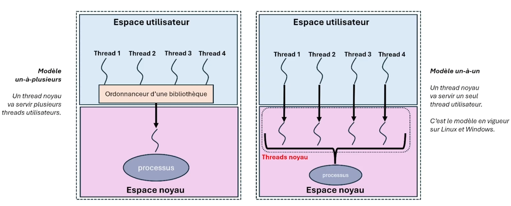

# INF2610 — Chapitre 3: Threads (Fils d'exécution)

## 1. Qu’est ce qu’un thread ?

- **Définition :** Un thread est une unité d'exécution légère. Un processus peut contenir plusieurs threads.
- **Identifiant :** Un thread a un numéro d’identification unique appelé TID (Thread Identifier).
- **Représentation :** Un thread est représenté par une structure de données appelée TCB (Thread Control Block).

  - Dans Linux, le TCB est une `task_struct`.
  - La table des threads est une liste doublement enchaînée de `task_struct`.

  ### Informations supplémentaires

  - fork() d'un processus duplique uniquement le thread principal du processus.

  - Le mode par défaut d'annulation des threads est "deferred".
  - Il y a aucune hiérarchie entre les threads. Donc n'importe quel thread peut annuler n'importe quel autre thread, il n'y a pas de relation parent-enfant entre les threads.

## 2. Concurrence et parallélisme

- **Concurrence :** L'exécution de plusieurs tâches entrelacées sur un même processeur. On donne l'illusion d'exécuter plusieurs tâches en même temps.
- **Parallélisme :** L'exécution de plusieurs tâches sur plusieurs processeurs en même temps.

## 3. Fils d'exécution (execution context)

- À la création d'un processus, un fil d'exécution appelé fil d'exécution principal est créé.
- Un fil d'exécution peut créer des fils d'exécution supplémentaires qui peuvent à leur tour créer d'autres fils d'exécution.
- Il n'y a pas de relation hiérarchique entre les fils d'exécution.
- Les fils d'exécution sont rattachés au processus et partagent les ressources du processus :
  - Espace d'adressage
  - table des descripteurs de fichiers
  - table des gestionnaires de signaux

### Avantages des fils d'exécution

1. **Réactivité :** Un fil d'exécution peut être utilisé pour répondre à des événements en dehors du fil d'exécution principal.
2. **Économie d'espace et de temps :** le partage des ressources entre les fils d'exécution permet d'économiser de l'espace mémoire et du temps de calcul. Les fils d'exécution peuvent communiquer entre eux sans passer par des appels systèmes. Les opérations de création ou d'arrêt, ou encore les changements de contexte, sont plus rapides avec les fils d'exécution.
3. **Extensibilité (scalability) :** Les fils d'exécution permettent de mieux tirer profit des architectures multiprocesseurs. Un processus qui ne comporte qu'un seul fil d'exécution ne pourra être exécuté que sur un seul processeur.

### Inconvénients des fils d'exécution

1. **Conditions de concurrence (race condition):** Les accès concurrents aux données partagées peuvent causer des incohérences. Utilisation de mécanismes de synchronisation pour éviter cela.
2. **Risque d'épuisement et gaspillage des ressources:** La création d'un nombre important de threads peut épuiser les ressources du processus.
3. **Cohérence des caches des processeurs:** Cela peut affecter les performances des processus multithreads.

## 4. Multi-threading

**Moins populaire aujourd'hui :** le modèle un-à-plusieurs.  
**Utilisé de nos jours :** le modèle un-à-un (nécessite plus de ressources : plusieurs threads noyaux nécessaires).



## Threads POSIX (librairie pthread)

### Création d’un thread - pthread_create

```c
int pthread_create(pthread_t* tid, const pthread_attr_t* attr, void* func, void* arg)
```

où :

- `tid` sert à récupérer l’identifiant du thread créé,
- `attr` spécifie les attributs de création du thread (NULL pour les attributs par défaut), _Généralement dans le cours on met null_
- `func` est le nom de la fonction exécutée par le thread,
  _Cette fonction est exécuté dans le contexte d'exécution du thread. On passe donc un pointeur vers l'emplacement en mémoire de la fonction. On peut seulement passer 1 argument. Si on veut passer plusieurs paramètres, il faut les mettres dans une structure et ensuite la déballer en fonction de ce qu'on veut faire._
- `arg` est l’argument à passer à la fonction `func`.

Le prototype de la fonction `func` est :

```c
void* func(void* arg);
```

Cet appel retourne `0` en cas de succès et une valeur différente de `0` en cas d’échec.

#### Petite astuce

Il est possible de passer un argument en tant que pointeur.

```c
pthread_create(&tid, NULL, thread_func, (void*)40000000);

et si on veut le récupérer :
void* thread_funct(void*p) {
  printf("%ld\n", (void**) &p);
  pthread_exit(NULL);
}
```

### Terminaison d’un thread

- **Normalement:** fin du thread lui-même.

  ```c
  void pthread_exit(void* pvaleur)
  ```

  - `pvaleur` est la valeur de retour du thread.

- **Avec force:** fin du thread par un autre thread.

  ```c
  int pthread_cancel(pthread_t tid)
  ```

  - `tid` est l'identifiant du thread à annuler.

### Attente de la fin d’un thread - pthread_join

```c
int pthread_join(pthread_t tid, void** pstatus)
```

où `pstatus` peut être :

- `&pval`, si le thread `tid` s’est terminé avec `pthread_exit(pval)`
- `PTHREAD_CANCELED`, si le thread `tid` s’est terminé anormalement avec `pthread_cancel`.

### Nettoyage des threads

```c
void pthread_cleanup_push(void* func, void* arg)
void pthread_cleanup_pop(int execute)
```

- `func` est la fonction de nettoyage à exécuter lors du dépilement du push.
- `arg` est l'argument à passer à la fonction de nettoyage.
- `execute` est un booléen qui indique si la fonction de nettoyage doit être exécutée.

```c
void func(void* arg) {
  printf("Cleaning up\n");
}
```

Si on se rend pas au bout de notre thread, on peut utiliser le nettoyage de thread pour libérer les ressources.

Chaque thread a un bit d'annulation. Si on veut annuler un thread, on doit désactiver son bit d'annulation `PTHREAD_CANCEL_DISABLE`

```c
void pthread_setcancelstate(int state, int *oldstate);
```

- `state` peut être `PTHREAD_CANCEL_ENABLE` ou `PTHREAD_CANCEL_DISABLE`.
- `oldstate` est un pointeur vers une variable dans laquelle stocker l'ancien état du thread.

### Exemple d'utilisation

#### Exemple de code :

Programme pour l’incrémentation concurrente d’une variable :

```c
#include <stdio.h>
#include <pthread.h>

long a = 0;

void* thread_func(void* arg) {
    for (long i = 0; i < *(long *)arg; i++) {
        a++;
    }
    return NULL;
}

int main() {
    pthread_t tid1, tid2;
    long increment1 = 40000000, increment2 = 80000000;

    pthread_create(&tid1, NULL, thread_func, &increment1);
    pthread_create(&tid2, NULL, thread_func, &increment2);

    pthread_join(tid1, NULL);
    pthread_join(tid2, NULL);

    printf("Value of a: %ld\n", a);
    return 0;
}
```

Dans ce programme on se rend compte que le résultat final n'est pas la somme des deux incrémentations. Cela est du au fait que les deux threads accèdent et modifient la variable `a` en même temps, ce qui cause un **problème de concurrence**.

## Threads noyau vs Threads utilisateur


On n'utilise plus les threads utilisateur depuis longtemps donc on ne les étudiera pas.

## Cas de Linux

Les threads noyaux sont plus lourds que les threads utilisateur. Ils sont donc plus lents à créer et à détruire.

L'ordonnanceur du système alloue du temps CPU aux threads noyaux.

`vfork` c'est comme `fork` mais le processus créateur reste bloqué jusqu'à ce que le processus fils créé se termine ou remplace son code exécutable par un autre (ex: via `exec`). De plus le processus père et fils partagent le même espace d'adressage (lecture et écriture).

### Système clone

```c
#include <sched.h>
#include <stdio.h>
#include <stdlib.h>
#include <unistd.h>

int clone_child(void *arg) {
    printf("Clone child PID: %d\n", getpid());
    return 0;
}

#define STACK_SIZE (1024 * 1024)

int main() {
    void *child_stack = malloc(STACK_SIZE);

    if (child_stack == NULL) {
        perror("malloc");
        exit(EXIT_FAILURE);
    }

    pid_t pid = clone(clone_child, child_stack + STACK_SIZE, CLONE_VM | CLONE_FS | CLONE_FILES | CLONE_SIGHAND | CLONE_THREAD | SIGCHLD, NULL);

    if (pid == -1) {
        perror("clone");
        exit(EXIT_FAILURE);
    }

    printf("Parent PID: %d\n", getpid());

    sleep(1);  // wait for child to finish

    free(child_stack);
    return 0;
}
```

## Librairie pth

### Exemple de code :

```c
#include <stdio.h>
#include <pth.h>

long long counter = 0;
#define MAX 1000000000

void* count(void *arg) {
    long long* pc = (long long*) arg;
    for (long long i = 0; i < MAX; i++) { *pc += 1; }
    pth_exit(NULL);
    return NULL;
}

int main() {
    pth_t t1, t2;
    pth_init();

    t1 = pth_spawn(PTH_ATTR_DEFAULT, count, (void*)&counter);
    t2 = pth_spawn(PTH_ATTR_DEFAULT, count, (void*)&counter);

    pth_join(t1, NULL);
    pth_join(t2, NULL);

    printf("pid= %d counter=%llu\n", getpid(), counter);
    return 0;
}
```
