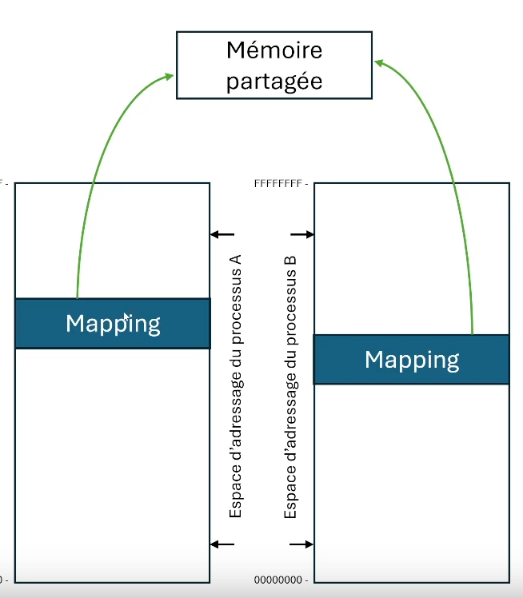
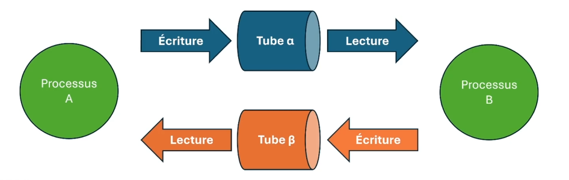

# INF2610 — Chapitre 4: Communication entre processus

## 1. Communication par mémoire partagée

Chacun des deux processus A et B accèdent, via son stockage d'adressage, à un objet de mémoire partagée qui sera stocké en mémoire physique, sur le disque, etc.

On crée un objet de mémoire partagée grâce à la fonction `shm_open` (comme pour les fichiers), et on utilise `mmap` pour le mapper dans l'adressage de chaque processus.



### Exemple

```c
int main() {
  int fd = shm_open("mon_segment", O_CREAT | O_RDWR, 0666);
  ftruncate(fd, 4096);
  void *ptr = mmap(NULL, 4096, PROT_READ | PROT_WRITE, MAP_SHARED, fd, 0);
  strcpy(ptr, "Hello, world!");
  shm_unlink("mon_segment");
  return 0;
}
```

## 2. Tubes de communication

Les tubes de communication sont des fichiers spéciaux utilisés pour permettre la communication entre processus, basés sur une politique FIFO (First In First Out).

- **Tubes Anonymes**:

  - Permettent une communication **unidirectionnelle** entre un processus créateur et ses descendants.
  - Création via l'opérateur shell `|` ou l'appel système `pipe()` **le pipe doit être exécuté avant le `fork()`**.
  - Exemple de redirection : `ls | sort` utilise un tube anonyme pour rediriger la sortie de `ls` vers `sort`.
  - `pipe(fd)` retourne deux descripteurs de fichiers: un pour la lecture, un pour l'écriture.
  - `read(fd[0], buf, size)` pour lire, `write(fd[1], buf, size)` pour écrire.
  - `close(fd)` pour fermer un descripteur de fichier.
  - Le tube est supprimé lorsque tous les descripteurs de fichiers sont fermés.

- **Tubes Nommés**:

  - Utilisés pour des processus d'une même machine, même sans lien de parenté.
  - Création avec l'appel système `mkfifo("~/mon_tube", 0666)` et ouverture via `open(path, O_RDONLY|O_WRONLY)`, open est bloquante si le tube n'est pas ouvert par un autre processus.
  - Permettent une synchronisation garantissant qu'il y ait au moins un écrivain et un lecteur à l'ouverture du tube.
  - Des dangers d'interblocage existent si les tubes nommés sont ouverts de manière asynchrone.
  - Exemple: `cat fichier.txt | sort | uniq`
  - Pour fermer le tube: `close(fd)`
  - Pour supprimer le tube: `unlink(path)` ou rm avec le nom du fichier.

  Le read bloque lorsque y'a rien à lire et le write bloque lorsque c'est plein (4096 octets). On peut penser au pot de scrabble 😅.



## 3. Redirection des Entrées et Sorties Standards

Il est possible de rediriger les entrées et sorties standards d'un processus vers d'autres fichiers ou tubes en utilisant les fonctions `dup` et `dup2`. Ces fonctions créent des descripteurs de fichiers synonymes, permettant des associations différentes comme la redirection de la sortie standard vers un fichier.

## 4. Signaux

Les signaux sont un mécanisme de notification d'événements et d'erreurs dans les processus.

- **Gestion et Utilisation**:
  - Les processus peuvent envoyer des signaux via `kill()`, se mettre en attente de signaux avec `pause()` ou `sleep()`, et définir des gestionnaires de signaux via `signal()` ou `sigaction()`.
  - Les signaux peuvent être différés en les ajoutant à un masque avec `sigprocmask()` et récupérés via `sigpending()`.
- **Différents types de signaux**:

  - SIGINT: Interruption par Ctrl+C.
  - SIGKILL: Arrêt brutal sans possibilité de capture.
  - SIGSTOP: Arrêt temporaire.
  - SIGCONT: Reprise d'un processus arrêté.
  - SIGCHLD: Signal envoyé lorsque un processus fils termine (ignorer le signal avec `signal(SIGCHLD, SIG_IGN)`)

  Les signaux SIGKILL et SIGSTOP doivent nécessairement être traités par leur gestionnaire par défaut.

  - **Asynchrone vsW Synchrone Signal**:
    - Asynchrone: Ils sont acheminés au fil d'exécution à la source du signal.
    - Synchrone: Ils sont normalement acheminés à un fil d'exécution quelconque du processus visé...
      - Généralement le premier fil d'exécution trouvé.
      - En autant que celui-ci ne bloque pas le signal en question.
    - `kill(pid, sig)` pour envoyer un signal à un processus.

# Supplémentaire

- La fin d'un processus entraîne la fermeture des descripteurs de fichiers
- La non-réception d'une fin de fichier peut causer un interblocage.
- C'est plus simple d'utiliser des threads que des processus pour de la communication inter éléments (thread ou processus), étant donné que la mémoire est partagée dans les threads.
