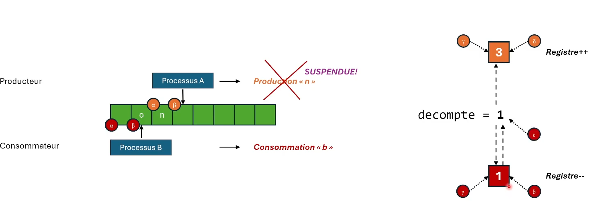

# INF2610 — Chapitre 5: Synchronisation de processus

### 1. Les conditions de concurrence

Étant donné qu'on partage les ressources entre plusieurs processus, il faut s'assurer que les processus ne vont pas entrer en conflit.



#### 1.1 Le problème de la section critique

```cpp

while (true) {
    // Section d'initialisation
    // ...

    Section critique
    ...

    // Section de terminaison
    // ...
}

```

1. **Un seul processus** à la fois en section critique;
2. **Aucune hypothèse** quant aux vitesses relatives des processus et au nombre de processeurs;
3. **Aucun blocage** par un processus qui n'est pas dans sa section critique;
4. **Pas d'attente excessive** subie par un processus avant d'entrer en section critique.

Donc finalement, on veut que les processus arrivent à entrer en section critique dans l'ordre et sans exécuter du code inutile (pour optimiser le temps).

#### Solution de Peterson

```cpp
// initialisation 

bool flag[2];
flag[0] = false;
flag[1] = false;
int tour;

// Fil d'exécution 0

while (true) {
  flag[0] = true;
  tour = 1;

  // Scrutation pour vérifier si le fil d'exécution 1 est en section critique (on évite de rentrer en section critique si le fil d'exécution 1 est en section critique)
  while(flag[1] && tour == 1);
  // Section critique
  flag[0] = false;
  // Section restante
}

// Fil d'exécution 1

while (true) {
  flag[1] = true;
  tour = 0;
  while(flag[0] && tour == 0);
  // Section critique
  flag[1] = false;
  // Section restante
}
```


